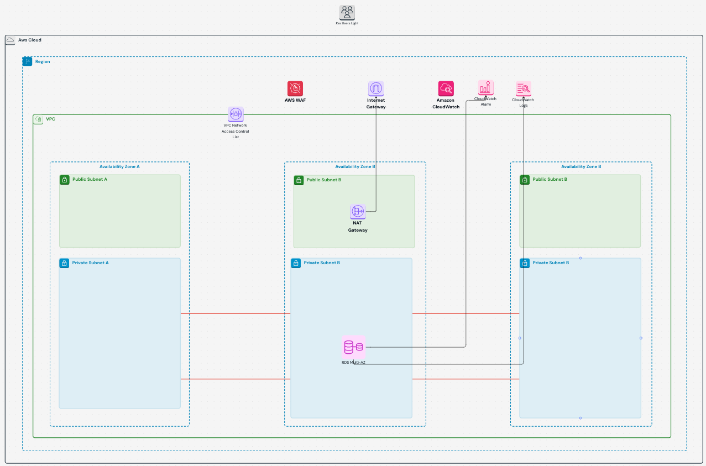

# Infrastructure as Code Task

## Objective
Deploy an **AWS PostgreSQL RDS** instance using **Terraform** with a focus on **security, monitoring, and cost optimization**.

---

## **Infrastructure Overview**

### **1️⃣ Basic Infrastructure**
- **VPC** with **public & private subnets** (spread across multiple Availability Zones)
- **Internet Gateway (IGW)** for public subnets
- **NAT Gateway** for private subnets (so RDS can fetch updates while staying private)
- **Security Groups & NACLs** with strict ingress/egress rules

### **2️⃣ PostgreSQL RDS Setup**
- **Multi-AZ PostgreSQL RDS instance** in a private subnet
- **Automated backups enabled**
- **Performance Insights activated**
- **Storage Autoscaling enabled**
- **TLS Encryption enforced**

### **3️⃣ Monitoring & Security**
- **CloudWatch Alarms** for:
  - CPU Utilization
  - Storage Capacity
  - Connection Count
- **AWS WAF Rules** to filter traffic
- **IAM-based access restrictions**
- **SSL/TLS encryption**
- **Dedicated Network ACL for RDS security**

### **4️⃣ Cost Considerations**
- **Optimized instance selection** using `t4g` instances for cost efficiency and performance
- **Auto-scaling configuration** to ensure right-sizing resources
- **Reserved Instances for long-term savings**
- **Storage on `gp3` for better performance at a lower cost**
- **Efficient NAT Gateway configuration** to minimize data transfer costs
- **AWS WAF for reducing unnecessary inbound traffic costs**
- **CloudWatch monitoring to avoid unexpected over-utilization**
- **Utilizing Spot Instances where applicable for cost reductions**

| Cost Factor                 | Description |
|-----------------------------|-------------|
| **Instance Type**           | `t4g` instances chosen for cost efficiency and performance |
| **Storage Type**            | `gp3` storage used to balance performance and cost |
| **Auto-scaling**            | Right-sizing resources to reduce over-provisioning costs |
| **NAT Gateway Optimization** | Single NAT Gateway setup to minimize costs |
| **AWS WAF**                 | Blocks unwanted traffic to reduce unnecessary costs |
| **CloudWatch Alarms**       | Prevents unexpected overuse leading to higher bills |
| **Reserved Instances**      | Long-term cost savings by committing to reserved instances |

### **Estimated Monthly Cost Breakdown**
| Service                      | Estimated Monthly Cost |
|------------------------------|-----------------------|
| **RDS Instance (Multi-AZ)**  | $33.12 |
| **RDS Storage (20GB gp3)**   | $2.30 |
| **NAT Gateway**              | $36.90 |
| **AWS WAF**                  | $8.00 |
| **CloudWatch Alarms**        | $0.00 (Free Tier) |
| **Outbound Data Transfer (50GB)** | $4.50 |
| **Total Estimated Cost**     | **Min of $84.82** |

> **Note:** Costs are estimates and may vary based on actual usage and AWS region.

---

## **Project Structure**
```bash
infrastructure/
 ├── terraform/
 │   ├── main.tf               # Main Terraform configuration
 │   ├── modules/              # Terraform modules
 │   │   ├── network/          # VPC, Subnets, IGW, NAT
 │   │   ├── security-group/   # Security Groups & NACLs
 │   │   ├── rds/              # PostgreSQL RDS setup
 │   │   ├── cloudwatch/       # CloudWatch alarms
 │   ├── variables.tf          # Input variables
 │   ├── terraform.tfvars      # Variable values (not committed)
 │   ├── outputs.tf            # Outputs (e.g., RDS endpoint)
 │   ├── providers.tf          # AWS provider configuration
 │   ├── README.md             # Setup & maintenance guide
```

---

## **Setup & Deployment**
### **1️⃣ Initialize Terraform**
```sh
cd infrastructure/terraform
terraform init
```

### **2️⃣ Configure Variables**
Modify `terraform.tfvars` to fit your AWS setup:
```hcl
aws_region = "us-east-1"
db_instance_class = "db.t4g.micro"
db_name = "assessment_db"
allocated_storage = 20
```

### **3️⃣ Plan & Apply**
```sh
terraform plan
terraform apply -auto-approve
```

### **4️⃣ Verify Deployment**
Retrieve RDS endpoint:
```sh
echo "Database Endpoint: $(terraform output rds_endpoint)"
```

---

## **Security Considerations**
- RDS is **not publicly accessible**
- Security Groups **restrict database access** to whitelisted sources
- IAM roles restrict access to Terraform-managed resources
- **TLS enforced** for secure connections
- **AWS WAF configured to block malicious traffic**

---

## **Monitoring & Maintenance**
### **Monitoring with CloudWatch**
- CPU Usage: Trigger alerts if usage exceeds 75%
- Storage: Alerts on remaining space below 20%
- Connection Count: Alert if max connections approach 80%

### **AWS WAF for Security**
- Blocks **SQL injection attempts**
- Limits request rates from single IPs
- Blocks known **malicious IP addresses**

### **Maintenance Tasks**
- Regularly update **database parameter groups**
- Adjust **instance sizes** based on usage patterns
- Enable **automatic backups & snapshots**

---

## **Submission Checklist**
✅ **Complete Terraform Configurations**  
✅ **Architecture Diagram**  
✅ **Cost Estimation Table**  
✅ **Security Considerations Documentation**  
✅ **Setup & Maintenance Instructions**  
✅ **AWS WAF Rules for Protection**  

---

## **Next Steps**
- [ ] Deploy a **staging environment** before production
- [ ] Implement **IAM roles** for fine-grained permissions
- [ ] Set up **automated Terraform CI/CD** for deployments

🚀 **Mark Perez** 🎯